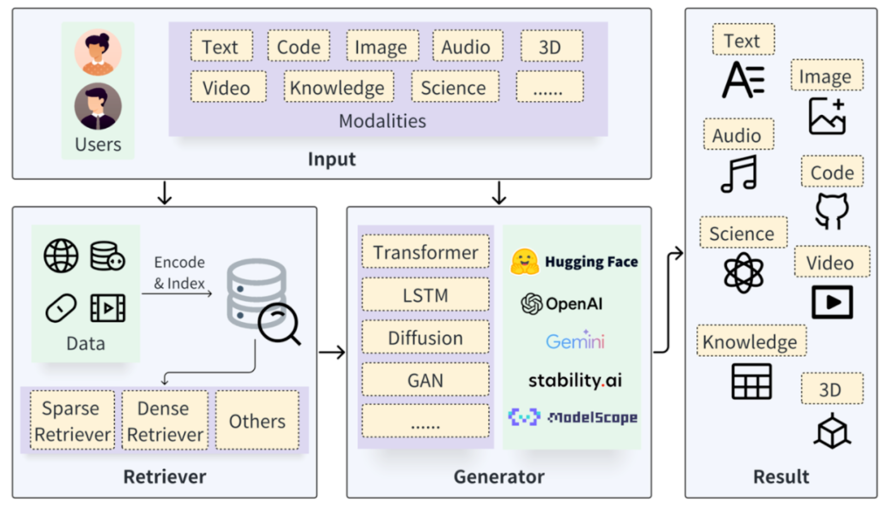

# RAG 检索增强生成技术背景介绍

RAG（Retrieval-Augmented Generation，检索增强生成） 是一种结合了信息检索技术与语言生成模型的人工智能技术。该技术通过从外部知识库中检索相关信息，并将其作为提示（Prompt）输入给大型语言模型（LLMs），以增强模型处理知识密集型任务的能力，如问答、文本摘要、内容生成等。RAG模型由Facebook AI Research（FAIR）团队于2020年首次提出，并迅速成为大模型应用中的热门方案。

RAG一般有三个步骤：
1. 检索：检索是RAG流程的第一步，从预先建立的知识库中检索与问题相关的信息。这一步的目的是为后续的生成过程提供有用的上下文信息和知识支撑。

2. 增强：RAG中增强是将检索到的信息用作生成模型（即大语言模型）的上下文输入，以增强模型对特定问题的理解和回答能力。这一步的目的是将外部知识融入生成过程中，使生成的文本内容更加丰富、准确和符合用户需求。通过增强步骤，LLM模型能够充分利用外部知识库中的信息。

3. 生成：生成是RAG流程的最后一步。这一步的目的是结合LLM生成符合用户需求的回答。生成器会利用检索到的信息作为上下文输入，并结合大语言模型来生成文本内容。

# RAG Retrieval-Augmented Generation for Knowledge-Intensive NLP Tasks

## 研究背景
这篇文章的研究背景是大型预训练语言模型虽然能够在下游NLP任务中存储事实性知识并取得优异表现，但在访问和精确操作知识方面仍然有限。因此，在知识密集型任务中，这些模型的表现落后于特定任务的架构。此外，提供决策的可追溯性和更新世界知识仍然是开放的研究问题。

文章着眼于此，提出的RAG模型通过结合预训练的参数化记忆和非参数化记忆，在知识密集型NLP任务中取得了显著的性能提升。
## 研究方法

这篇论文提出了两种RAG模型：RAG-Sequence和RAG-Token，用于解决知识密集型任务中的生成问题：

1. ​**RAG-Sequence模型:**​ 该模型使用相同的检索文档来生成整个序列。它将检索到的文档视为一个单一的潜在变量，并通过top-K近似来边缘化以获得seq2seq概率。

2. ​**RAG-Token模型:**​ 该模型为每个目标标记抽取不同的潜在文档，并相应地进行边缘化。这允许生成器在生成答案时从多个文档中选择内容。

检索器使用DPR（Dense Passage Retriever）作为检索组件，采用双向编码器架构，通过最大内积搜索（MIPS）问题近似求解top-K文档。

生成器：使用BART-large作为生成器组件，通过连接输入和检索内容来生成输出。

## 实验
实验采用了多个知识密集型NLP任务的数据集，包括自然问题（NQ）、TriviaQA（TQA）、WebQuestions（WQ）、CuratedTrec（CT）、MS-MARCO、Jeopardy问题生成和FEVER。


这篇论文还是很值得一读的，等后续时间充足了再来补一下精读的文档
