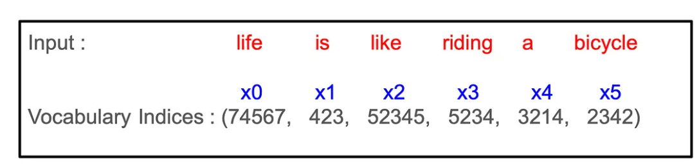
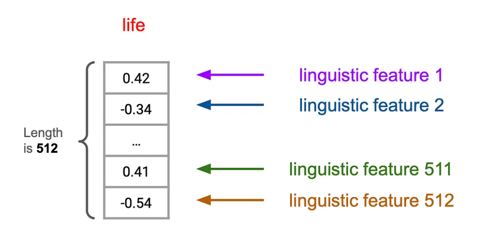
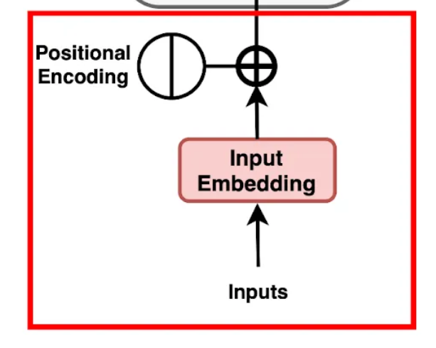
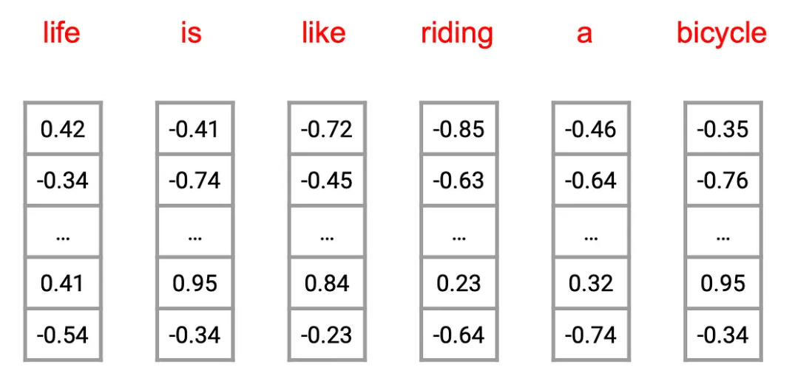
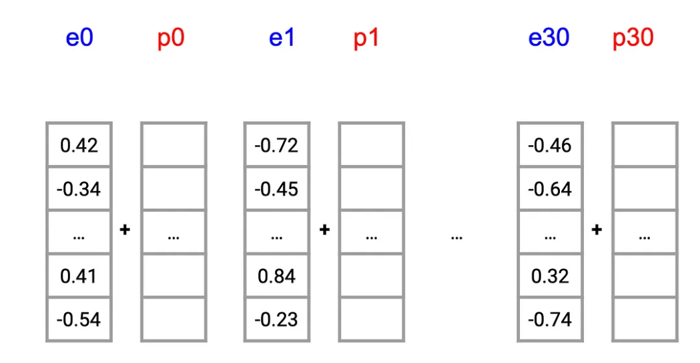
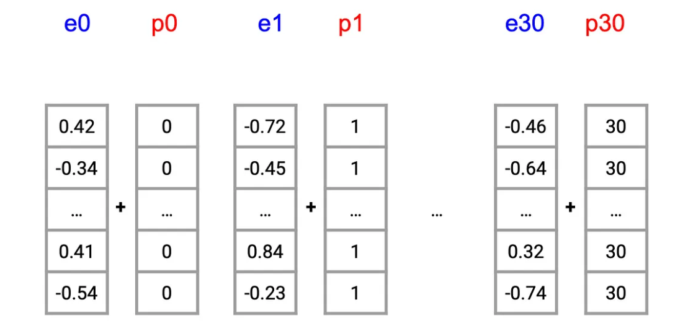
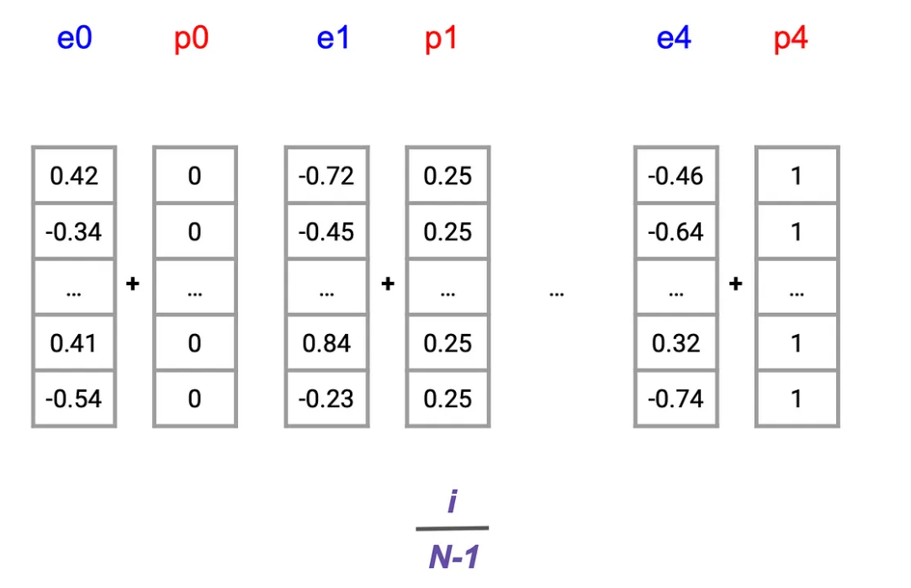
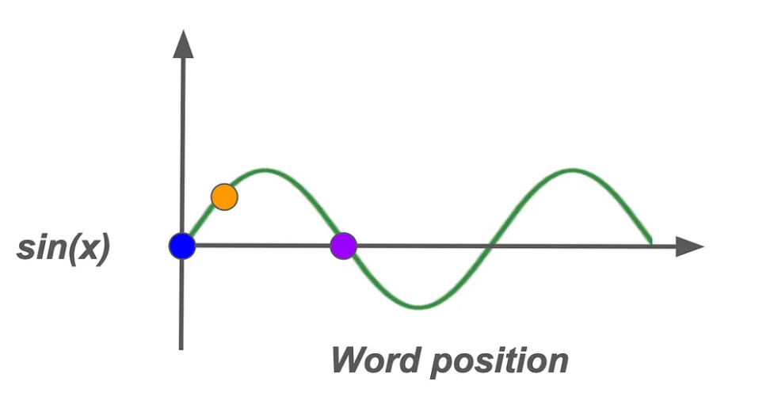
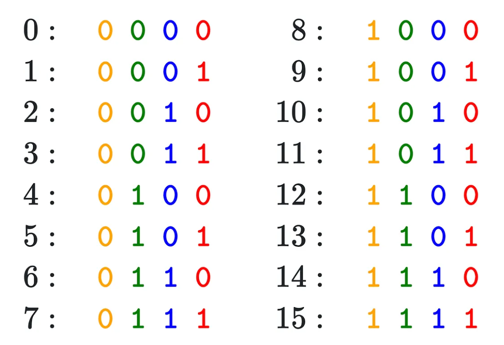

## 大模型编码梳理
本部分将以Transformer模型为例，梳理大模型生成嵌入的思路。


（参考[解码Transformer：深入理解输入、嵌入和位置编码](https://www.atyun.com/60798.html)）

计算机无法直接理解人类语言。它们需要将文本以数字形式表示——使用向量、矩阵或数字序列。这种转换使得像Transformer这样的模型能够处理数据并从中学习。以Transformer为代表的模型通常生成嵌入的思路如下：


### 一、将输入文本转换成序列

使用任何机器学习模型的第一步都是处理输入数据。假如我们现在有这样一个输入文本是：
```
“Life is like riding a bicycle”
```

#### （一）构建词汇表

在处理文本之前，需要创建一个词汇表——一个包含训练数据集中每个单词的字典。例如，如果我们的训练数据包含各种励志名言，我们的词汇表可能包括“生活”、“平衡”、“自行车”、“前行”等词汇。每个单词都映射到一个唯一的索引。因此，训练数据中所有不重复的单词将组成词汇表。
<style>
.center 
{
  width: auto;
  display: table;
  margin-left: auto;
  margin-right: auto;
}
</style>

<p align="center"><font face="黑体" size=2.>表1 词汇表示例</font></p>

<div class="center">

| 单词 | a   | ant | bicycle | is  | joker | kite | life | like | riding | see | thank | ... |
| ---- | --- | --- | ------- | --- | ----- | ---- | ---- | ---- | ------ | --- | ----- | --- |


</div>


#### （二）分配数字索引

接下来，我们为词汇表中的每个单词分配一个唯一的数字索引。这样，我们就可以用数字来表示单词了。
<style>
.center 
{
  width: auto;
  display: table;
  margin-left: auto;
  margin-right: auto;
}
</style>

<p align="center"><font face="黑体" size=2.>表2 单词分配索引示例</font></p>

<div class="center">

| 单词 | a    | ant  | bicycle | is  | joker | kite | life  | like  | riding | see | thank | ... |
| ---- | ---- | ---- | ------- | --- | ----- | ---- | ----- | ----- | ------ | --- | ----- | --- |
| 索引 | 3214 | 4234 | 2342    | 423 | 34    | 5352 | 74567 | 52345 | 5234   | 212 | 8567  | ... |
</div>


#### （三）提取输入单词的索引

对于输入文本“Life is like riding a bicycle”，我们提取相应的索引如下，
<style>
.center 
{
  width: auto;
  display: table;
  margin-left: auto;
  margin-right: auto;
}
</style>

<p align="center"><font face="黑体" size=2.>表3 提取输入文本中的单词分配索引示例</font></p>

<div class="center">

| 单词 | a    | bicycle | is  | life  | like  | riding |
| ---- | ---- | ------- | --- | ----- | ----- | ------ |
| 索引 | 3214 | 2342    | 423 | 74567 | 52345 | 5234   |


</div>

#### （四）转换成序列

这一系列的索引就是输入到Transformer模型中的数据。它作为输入文本的数值表示，使模型能够对其进行处理。



### 二、词嵌入

一旦我们有了输入序列的索引，下一步就是将这些索引转换成词嵌入。词嵌入将每个单词表示为固定大小的向量，使得模型更容易捕捉单词之间的语义关系。


词嵌入是编码单词语义信息的高维向量，相似的单词或经常同时出现的单词具有相似的嵌入。这些向量可以想象成一个多维空间，在这个空间中，由于上下文相似，“bicycle”（自行车）和“ride”（骑行）之间的距离比“bicycle”（自行车）和“cloud”（云）之间的距离更近。嵌入的每个维度都捕捉了某些语言特征，比如一个单词是动词还是实体。


我们序列中的每个词索引都会通过一个嵌入层来生成词嵌入。这个层将每个索引映射到一个实数向量。原始的Transformer论文中使用的嵌入大小为512。


这样的话经过embedding层之后我们就得到了这样一个嵌入：



### 三、位置嵌入

现在我们已经有了词嵌入，接下来需要解决一个关键问题——Transformer天生并不理解单词的顺序。与像LSTM这样的循环模型逐个处理序列中的单词不同，Transformer会同时查看所有单词。虽然这使得它们更快，但也意味着它们缺乏单词出现顺序的信息。

考虑以下两个句子：

_“Life is like riding a bicycle, it requires balance.”（生活就像骑自行车，它需要平衡。）_

_“Life requires balance, like riding a bicycle.”（生活需要平衡，就像骑自行车一样。）_

这两个句子包含相同的单词，但结构略有不同，导致意义上有细微差别。为了让Transformer捕捉到这些差异，我们需要添加关于单词顺序的信息——这就是位置嵌入发挥作用的地方。


#### （一） 常见的几种位置编码的思路：
- **方法1：基于整数的位置编码**
  - 一个直接的想法是给每个位置分配一个对应的整数。
  - 例如，第一个词的嵌入会携带一个全零向量，下一个词则是一个全一向量，依此类推。
  - 然而，这种方法很快就会暴露出局限性。随着序列长度的增加，分配给后续单词的较大数字可能会压过底层的词嵌入，导致表示发生偏斜。这种不对齐可能会影响模型保持语义一致性的能力，尤其是在较长文本中。
  
- **方法2：相对于序列长度的分数位置表示**
  - 另一种直观的方法是将每个单词的位置表示为总序列长度的一个分数，确保值在0到1之间保持归一化。
  - 例如，在一个包含四个单词的句子中，位置嵌入可能对应于像0.25、0.5这样的值。
  - 这一策略虽然看似有效，但却引入了一个重大挑战：相同位置（例如，第二个单词p1）的位置嵌入会因序列长度的不同而变化，从而引入不一致性，这可能会使模型感到困惑并降低性能。为了获得最佳结果，位置值理应独立于序列长度。
  
- **方法3：正弦位置嵌入**
  - 下一种方法利用正弦函数来生成位置嵌入，从而在x轴上创建一条平滑的波浪形曲线来编码单词位置。通过将单词位置映射到正弦波的高度，每个位置都会在一个有限范围内获得一个唯一值，无论序列长度如何。
  - 这种方法通过标准化位置嵌入值，缓解了之前方法中出现的扭曲风险。
  - 然而，一个缺点出现在曲线上对称位置的单词上（例如，在可视化环境中用蓝色和紫色等颜色表示）；尽管这些单词的位置不同，但它们产生的位置值却相同，这可能导致潜在的歧义。
  
- **方法4：受二进制启发的编码**
  - 最后，一种创新的视角借鉴了二进制表示原理。在二进制编码中，比特率的变化是可预测的；最低有效位在每个数字间交替变化，下一个较低的位在每两个数字间交替，依此类推。
  - 将这种概念从二进制位转换为浮点数，可以实现一种紧凑且高效的编码机制，该机制能够在不占用过多计算资源的情况下保持单词位置的唯一性。
  


#### （二）Transformer方法：使用正弦函数的位置编码

在Transformer的背景下，通过正弦函数嵌入单词位置提供了一种精细的方法来连续捕获位置信息。该解决方案通过使用交替的正弦和余弦函数，解决了传统位置编码的挑战。这些函数表示出类似于二进制位模式的连续、平滑波形，但在基于浮点数的系统中更加灵活和高效。


- **正弦位置编码**：Transformer模型采用正弦和余弦函数生成位置嵌入。对于每个位置pos和维度i，位置嵌入的计算公式为：
    - 偶数维度：PE(pos, 2i) = sin(pos / 10000^(2i/d_model))
    - 奇数维度：PE(pos, 2i+1) = cos(pos / 10000^(2i/d_model))
  其中d_model是模型的嵌入维度。这种编码方式具有周期性，能够处理比训练时更长的序列，同时保持位置信息的一致性。


**正弦频率调制**

为了避免位置嵌入的冗余，不同位置使用不同频率的正弦函数，引入了一种微妙但强大的手段来区分序列中即使位置相近的单词。


根据嵌入向量中的每个位置而变化。在这里，变量i在产生这些变化中起着关键作用。通过在不同的i值下重新计算正弦曲线，在嵌入维度上生成了一系列具有不同频率的曲线，为每个位置pos创建了细微差别的位置嵌入。在这里，d=512，是位置嵌入的维度。

#### （三）将词嵌入和位置嵌入相加，得到最终的嵌入向量，作为Transformer模型的输入。

- **相加操作**：对于每个单词，将其词嵌入向量与对应位置的位置嵌入向量相加。例如，单词“生活”在句子中的位置为0，其词嵌入向量为E_word，位置嵌入向量为PE(0)，则最终的嵌入向量为E_word + PE(0)。
- **模型输入**：经过相加操作后得到的嵌入向量序列，包含了单词的语义信息和位置信息，被送入Transformer模型的后续层进行进一步处理。


#### 大模型对句子进行编码


前文介绍的编码方式是 **对句子中的每个词进行单独编码最后汇总成句子向量**，而目前大模型对句子进行编码时，主要分为两种情况：

1. **对句子中的每个词进行编码**：BERT模型会为句子中的每个词生成一个固定维度的向量。具体维度取决于所使用的BERT模型版本。例如，对于一个包含50个词的句子：
  
   - 对于**BERT-Base**，隐藏层维度为**768维**；对于**BERT-Large**，隐藏层维度为**1024维**。使用**BERT-Base**时，每个词的编码维度为**768维**，最终得到一个形状为**[50, 768]**的矩阵；
   - 使用**BERT-Large**时，每个词的编码维度为**1024维**，最终得到一个形状为**[50, 1024]**的矩阵。

2. **将整个句子编码为一个固定维度的向量**：如果希望将整个句子编码为一个固定维度的向量，BERT模型通常会使用一个特殊的标记（如`[CLS]`）来表示整个句子的语义信息。
   - `[CLS]`标记的输出维度与模型版本的隐藏层维度一致。对于**BERT-Base**，`[CLS]`标记的输出维度为**768维**；对于**BERT-Large**，`[CLS]`标记的输出维度为**1024维**。
   - 因此，无论句子中有多少个词，最终的句子编码都是一个固定维度的向量，即对于**BERT-Base**，句子编码的维度为**768维**；对于**BERT-Large**，句子编码的维度为**1024维**。


BERT模型在处理句子类型的编码时，会通过以下几种方式来统一维度，无论是句子过短还是过长：

1. **句子长度不足最大长度**
   - 当句子长度不足BERT模型的最大长度限制（通常为512）时，BERT会通过**填充（Padding）**来统一维度：
     - 在句子的末尾添加`[PAD]`标记，直到句子长度达到预设的最大长度。
     - 这样可以确保所有输入序列的长度一致，便于模型处理。

2. **句子长度超过最大长度**
   - 当句子长度超过BERT模型的最大长度限制（512）时，有以下几种处理方法：
     1. **截断（Truncation）**
        - 直接将句子截断到最大长度（512），丢弃超出部分。
        - 这种方法简单直接，但可能会丢失一些重要的上下文信息。
     2. **滑动窗口（Sliding Window）**
        - 将长文本分割成多个长度为512的片段，每个片段之间有一定重叠。
        - 对每个片段分别进行编码，然后将结果合并。
        - 这种方法可以保留更多的上下文信息，但计算成本较高。
     3. **关键片段提取（Key Text Extraction）**
        - 使用特定的机制（如CogLTX中的MenRecall模块）从长文本中提取与任务相关的关键片段。
        - 将这些关键片段组合成新的文本，其长度不超过512，然后输入BERT模型。
        - 这种方法可以有效减少信息丢失，同时降低计算成本。
     4. **修改位置编码（Position Embeddings）**
        - 通过修改BERT的位置编码，使其能够处理更长的文本。
        - 例如，将位置编码的长度从512扩展到1024，通过拼接或重新初始化等方式实现。
        - 这种方法需要对BERT模型进行一定的修改，但可以处理更长的文本。

BERT模型通过填充、截断、滑动窗口、关键片段提取和修改位置编码等方式来处理不同长度的句子，确保输入维度的一致性，同时尽量减少信息丢失并保持计算效率。